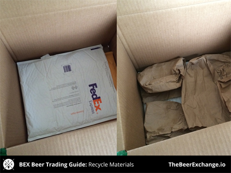
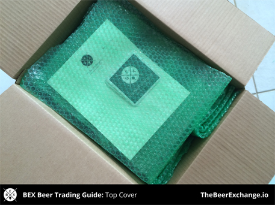

# How to Pack and Ship Beer: A Comprehensive Guide
Produced by Mark Iafrate with help from the BEX Community

> [Download Full PDF](./assets/pdf/BEX Packing and Shipping Guide.pdf)
> 
> If you want to save this document for later use, you can download the PDF at the link above. Feel free to distribute it! Don't hesitate to contact us with questions, comments or suggested changes. Cheers!

### The Purpose of this Guide
This is meant to serve as an outline for teaching beginner traders how to properly package and ship beer to their trading partner. Keep in mind, there are lots of ways to safety and securely prep beer for shipping, and this is in no way meant to be a final word on that process. It's simply one method that I, among others in the trading community, have successfully used for some time.

### Table of Contents:
* [Introduction](#things-to-know-before-you-get-started)
* [Shipping and Packing Materials](#shipping-and-packing-materials)
* [Step by Step Packing Process](#1-gather-your-packing-supplies-and-beer)
* [Additional Advice](#additional-advice)
* [Credits and Contact Information](#credits-and-contact-information)

## Things to Know Before You Get Started
Sending beer without a license [is against](http://www.fedex.com/us/service-guide/terms/express-ground/) shipping companies' [policies](http://www.ups.com/content/us/en/resources/ship/terms/shipping/index.html), so any trading you do is at your own risk. That being said, it's common knowledge among people working for FedEx, UPS and even USPS that people actively trade and ship beer.

It's a good idea to open a shipping account with either FedEx or UPS. I encourage people to not send through USPS. When you open an account you can:
* Easily create shipping labels and print them at home
* Save tons of time when dropping off packages
* Automate your payments
* Get discounts on shipping (sometimes)

Do package your beer before you get to the shipping place. Don't ever pack it there. If someone asks you what's in the box, you can say something like "collectible glassware," "vintage sodas," "olive oils," etc. Some people say "live yeast samples" which is one of the better, more truthful answers. To be honest, I've only been asked once or twice what I'm sending.

* * *

## Shipping and Packing Materials
For the sake of simplicity, I'll list what I consider to be the essentials for safely sending a normal sized trade. To some this might be overboard, and to others this might be not nearly enough. However I've come to learn this is a good process for those getting started.

_Tip: Purchase your shipping supplies through Amazon.com or at a larger retailer in bulk. Stores like FedEx and UPS sell them at a much higher markup._

* **Corrugated shipping boxes**: Make sure you're using boxes that are sturdy and don't have gaps or holes in them. The last thing you want is your box getting a huge puncture or rip in it, exposing bottles or cans.
Bubble wrap: Don't need to overdo it, but don't skimp either. 
* **Gallon size Ziploc bags or plastic garbage bags**: These will protect the box from getting wet if something leaks. If a box is leaking liquids, it will get pulled by the shipping company and you'll be out all that beer. 
* **Rubber bands**: Use these instead of taping the bubble wrap. This makes it easier to reuse the bubble wrap, not to mention it cuts down on shipping tape, which can be expensive. 
* **Electrical tape**: This is somewhat optional but good to do. Wrap some electrical tape around bottle caps to prevent them from getting caught and popping off/springing a leak. 
* **Shipping tape**: You'll need more than you think.
* **Extra filler (optional)**: If you don't want to use bubble wrap for padding you can use old newspapers, etc. I try and avoid using packing peanuts because they are a pain to cleanup. 

* * *

## 1. Gather your packing supplies and beer
Get your beer and packing supplies together and double check to make sure your sending the right stuff to your trade partner. Remember to include extras if you and your partner agreed to do so!

This is my typical assortment of shipping materials. Lots of bubble wrap, gallon-sized Ziploc bags, plenty of shipping and electrical tape, and rubber bands.

I like boxes around these sizes. The 16"x12"x12" can fit a good amount of beer. It's always a good idea to reuse boxes whenever possible as long as they are in good condition.

These are just some of the beers I'll be sending out. For what it's worth, I was visiting family in Florida and shipping this box back to myself in North Carolina. If I were sending to a trade partner, I'd double check the agreed items and then make sure I had some solid local extras to send his or her way as well.

_Tip: Ship early in the week to avoid the package sitting for longer periods of time in a warehouse. The less time it's in transit, the better._

## 2. Secure bottle caps and place beer in plastic bags
Put electrical tape around the caps of bottles to prevent them from getting caught on something and leaking or coming off. 

Electrical tape is a good choice because it's easy to remove once your partner receives the box. All you need is to put one piece around the top, covering the edges of the bottle cap. You'll notice here that part of the bottle neck and the edge of the cap is covered.

If you're shipping bottles that are already waxed (or if you waxed them), you don't need to do this.

Placing each beer into a Ziploc bag will prevent the box for getting wet in the event of a break or rupture. You might think it's overkill but the last thing you want is to lose a shipment because you were in a rush.

Most bottles and cans will be able to fit into these gallon sized bags. Simply put them inside, remove as much air as possible, and make sure the bag is sealed tight.

For larger bottles, I typicaly use small garbage bags in lieu of the Ziploc bags. This still does the trick and chances are you already have them on hand.

## 3. Wrap and rubber band each beer
Use 2-3 sheets of bubble wrap per bottle and secure it with a rubber band (not tape). For bigger bottles or rarer ones that warrant extra protection, feel free to use more.  

This is the typical amount of bubble wrap I purchase at a time. I'm very careful when I ship so I probably use more than most, but I find people still go through this bubble wrap pretty quickly.

Once I wrap each botle in 2-3 sheets, I secure it with a single rubber band. I suggest you avoid tape because it is a pain to remove and makes it harder for people to reuse the bubble wrap.

For larger bottles or rare beer, I add another step where I flip the bottle and roll it length wise to protect the ends and add more protection. I then use an extra rubber band to keep it all together.

Once your done wraping and banding your beer, you're ready to start prepping the box to pack everything together.

## 4. Place your wrapped beer in your box
Setup your box and add some padding to the bottom. Start to layout the beer in the most efficient way to eliminate movement and maintain a snug fit. 

This is my 16x12x12 box all setup and ready to go. Remember to try and reuse good boxes whenever possible. It'll save you a good bit of money in the long run.

Recycle materials to act as padding and filler. Here I used some leftover padded envelopes and brown bags to act as the bottom layer of protection in my box.

Start to layer in your bottles and cans. In between each layer of beer, add in some more bubble wrap to prevent them from hitting each other. Continue until all your beer is packed.

You'll notice the top layer of beer didn't go all the way across the box, so I added some more filler to the left to keep the bottles from moving around. Now everything should be snug and won't jostle.

## 5. Add in your final materials and tape up the box
Add in any extra items like coasters, stickers, inserts, notes, etc. on top with a last layer of padding. Use your packing tape to seal it all up and make sure it's secure.  

If you traded with me before you've probably received one of my hand written notes. Most traders don't do this but I enjoy writing them. I also include BEX coasters, stickets, and other swag from time to time.

I add those items to the top and cover them with another single layer of bubble wrap. I always make sure there is padding on top of the beer in case something gets placed on top of the box during shipping.

Tape up your box securely. I always add some tape to the edges and over any areas that look like they are weak or might tear. Once that's done, you're ready to attach a shipping label (if you're printing them at home) or bring it to the shipping location. If you do the former, you can just drop off the box. If you do the latter, you'll need to provide them with your information along with the destination name and address.

**That's it! Now you're ready to send out your #BEXmail!**

* * * 

## Additional Advice
### Double Boxing
If possible, I recommend you double box your items, especially if you're shipping out really rare or limited bottles. The process is simple:
* Find another box that's slightly larger and can fit the one you just packed
* Add padding to the bottom of the larger box, then place the smaller box inside of it
* Add filler between the walls of both boxes and again on top
* Seal the last box like you did the first one

It might not always be needed but it's good to do for those trades where you don't want to leave anything to chance. 

### Create a Shipping Account
I have a FedEx account setup and it has made my life so much easier. Once you have an account setup, you can simply estimate the weight of the box (or weigh it if you want - either way they double check), print out your own shipping label, add it to a packing slip, and then seal it onto the box. Now all you need to do is drop it off at the location and they will bill your account accordingly.

_Note: Careful with "business" accounts. If something breaks FedEx will return or destroy the box and you'll probably get a letter from FedEx legal asking to see your ABC license and permit to ship._

### Use Shipping Containers
When asking BEX users for their packing and shipping tips, many mentioned purchasing molded shipping containers (many times advertised for shipping wine). These are especially useful if you want more protection for those special or rare bottles. They are available in various formats and molds depending on how many beers you're shipping. U-Haul sells them along with some other locations.

### Line Your Box with a Garbage Bag
Leaks are one of the biggest reasons boxes are pulled, so by simply lining your box with a garbage bag and placing all your beer inside that, you can significantly decrease the chances of losing your beer in the event of a leak.

* * * 

## Credits and Contact Information
### Conclusion
Remember, trading is fun and completely built on trust. Always make sure to take the time to include what you said you would and then a little more. Some extra effort in wrapping bottles and preventing leaks will go a long way and prevent you from losing a shipment (and dealing with the headaches that follow).

Lastly, don't hesitate to ask your trading partner or another community member for advice, especially if you're just starting out. Beer people are good people.

### Credits
Thanks to everyone who helped put this together! We gathered lots of great advice from BEX users, some of them are credited below. If I left you out, just let me know!

* Jeff Amend
* Bryce Bostrom
* Kevin Busha
* Tom Clements
* Patrick Elliott
* Josh Gampp
* Mike Hanner
* Lazaro Juarez
* Mark Krawczyk
* Corey Martin
* Jeff Mastera
* JC Nelson
* Miguel Rivas
* Sam Rozzi
* Chris Salles
* Luke Schmuecker

### Contact Information
Mark Iafrate [markiafrate@gmail.com](mailto:markiafrate@gmail.com)

[@BeerExchangeApp](https://twitter.com/beerexchangeapp) | [@TheBeerExchange](https://instagram.com/thebeerexchange) | [Join our Facebook group!](https://www.facebook.com/groups/thebeerexchange/)

